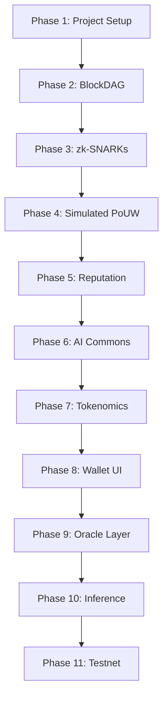

# **Project CCoin: A Private, Scalable, and Useful Peer-to-Peer Electronic Cash System**

## **Version 2.0 — The Decentralized AI Economy**

---

**Abstract.** A purely peer-to-peer version of electronic cash would allow online payments to be sent directly from one party to another without going through a financial institution. While existing solutions like Bitcoin solve the double-spending problem, they suffer from critical inefficiencies: energy waste through useless hashing, lack of true privacy due to public transaction graphs, and low throughput due to linear block generation. We propose **CCoin**, a network that replaces the linear blockchain with a Directed Acyclic Graph (DAG) for parallel throughput, enforces privacy via Zero-Knowledge Proofs (zk-SNARKs) with programmable selective disclosure, and secures the network via **Proof-of-Useful-Work (PoUW)**, where computational energy trains collectively-owned AI models governed by token holders. The network introduces **Reputation-Weighted Consensus**, where miner influence is earned through demonstrated quality of computational contributions, and an **AI Oracle Layer** that exposes trained models as decentralized inference endpoints for cross-chain consumption. CCoin is not merely a currency — it is a decentralized AI research institution whose assets grow with every block mined.

---

### **1. Introduction**

Commerce on the Internet has come to rely on trusted third parties. Bitcoin introduced a trustless system based on cryptographic proof [Nakamoto, 2008], but its security model — Proof of Work — relies on "one-CPU-one-vote" using energy that produces no external value. Furthermore, Bitcoin's privacy model is insufficient; linking transactions is unavoidable with multi-input transactions. And critically, the output of Bitcoin mining — trillions of SHA-256 hashes — is discarded the moment a block is found. The energy is consumed, and nothing of lasting value is produced.

Subsequent attempts to address these issues have been piecemeal. Zcash introduced zk-SNARKs for privacy but retained the linear chain and wasteful proof-of-work. IOTA and Kaspa explored DAG topologies but lack privacy guarantees. Various Proof-of-Useful-Work proposals exist in academic literature but none have solved the critical verification asymmetry problem at scale, nor have any addressed the question: **who owns the computational output, and who decides what gets computed?**

Project CCoin introduces five fundamental architectural shifts:

1. **Usefulness:** Computation must benefit humanity (AI model training, protein folding, climate simulation) while securing the network.
2. **Privacy:** Transactions must be verifiable without revealing the sender, receiver, or amount — with optional, granular, user-controlled disclosure.
3. **Speed:** The network must accept blocks in parallel (DAG) rather than sequentially.
4. **Collective Ownership:** The AI models produced by mining are collectively owned public goods, governed democratically by token holders.
5. **Meritocracy:** Miner influence is not solely determined by raw compute, but by the *quality* and *consistency* of their contributions over time.

---

### **2. The BlockDAG (Speed Layer)**

Instead of a single "longest chain", CCoin organizes blocks into a **Directed Acyclic Graph (DAG)**.

#### **2.1 Parallel Blocks**

In Bitcoin, if two nodes find a block simultaneously, one is discarded (orphaned). In CCoin, both blocks are accepted. A block $B$ references multiple previous blocks (parents), merging the history. This eliminates the throughput bottleneck inherent in single-chain architectures.

Each block header contains:

- `parents[]`: An array of hashes referencing 1..k parent blocks.
- `tx_root`: Merkle root of the transactions included.
- `pouw_result`: The hash of the PoUW computation result (see Section 3).
- `reputation_score`: The miner's current reputation coefficient (see Section 6).
- `timestamp`: Unix timestamp of block creation.

#### **2.2 Ordering Mechanism (The Math)**

To prevent double-spending in a DAG, we must establish a linear order over the graph. We use a modified GHOST-like voting rule enhanced with reputation weighting. The "weight" of a block is not just its own work, but the cumulative reputation-adjusted work of its sub-graph.

Let $G$ be the DAG. For any block $B$ mined by node $m$, the score $S(B)$ is defined as:

$$S(B) = Work(B) \cdot Rep(m) + \sum_{C \in Children(B)} S(C)$$

Where $Rep(m) \in [0.1, 3.0]$ is the reputation multiplier of the miner (see Section 6). Nodes select the "main chain" by greedily choosing the child with the maximum $S(C)$ at each fork. Transactions in "off-chain" blocks (blocks not on the main chain but still in the DAG) are included in the canonical ordering, but their timestamp is determined by their position relative to the main chain.

#### **2.3 Conflict Resolution**

When two transactions in the DAG conflict (i.e., attempt to spend the same nullifier), the transaction in the block with the higher $S(B)$ score takes precedence. The losing transaction is marked as invalid and its outputs are voided. Because the reputation multiplier $Rep(m)$ factors into block weight, blocks produced by high-reputation miners naturally win conflicts more often, providing an additional incentive for honest, high-quality behavior.

#### **2.4 Throughput Characteristics**

Because blocks are accepted in parallel, the network's throughput scales with the number of active miners rather than being fixed by a block interval. The DAG self-regulates: as more miners join, more parallel blocks are produced and merged. The ordering algorithm resolves conflicts deterministically without requiring a global clock or leader election.

---

### **3. Proof-of-Useful-Work (The Engine)**

We replace SHA-256 "scanning for a value" [Nakamoto, 2008] with computational puzzles that produce real-world value: training machine learning models, folding proteins, and running scientific simulations.

#### **3.1 The Puzzle**

Miners act as trainers for a distributed neural network. The network maintains a **Task Queue** — an on-chain registry of active computational tasks, each associated with a specific model, dataset, and objective.

- **Input:** A batch of data $D_i$ and current model weights $W_t$ for a specific task $\tau$.
- **Task:** Compute the gradient $\nabla L(\tau, D_i, W_t)$ such that the loss function decreases.
- **Output:** The result matrix $R$ containing the computed gradients.
- **Verification:** The miner submits $R$ along with a lightweight "Proof of Computation" — a verifiable random subset of the matrix multiplication steps, selected deterministically using a VRF (Verifiable Random Function) seeded by the block's parent hashes. This ensures verification is $O(\sqrt{n})$ while computation is $O(n)$, maintaining the critical asymmetry needed for consensus.

#### **3.2 The Threshold Formula**

Instead of finding a hash with leading zeros, the miner must find a nonce $n$ such that the hash of the solution $R$ satisfies the difficulty target $T$:

$$H(Header \| n \| Hash(R)) < T$$

However, the validity of block $B$ also requires two additional conditions:

**Condition 1 — Improvement Gate:**

$$Loss(W_t + \alpha \cdot \nabla L) < Loss(W_t)$$

Where $\alpha$ is the learning rate specified in the task parameters. This ensures the energy expended actually improved the model.

**Condition 2 — Quality Score:**

$$Q(B) = \frac{Loss(W_t) - Loss(W_t + \alpha \cdot \nabla L)}{Loss(W_t)}$$

The quality score $Q(B) \in (0, 1]$ measures the *magnitude* of improvement. This score is recorded on-chain and feeds into the miner's reputation (Section 6). A miner who consistently produces gradients that reduce loss by 5% earns more reputation than one whose gradients reduce loss by 0.01%.

#### **3.3 Task Difficulty Adjustment**

The difficulty target $T$ is adjusted every epoch (defined as 1000 DAG-ordered blocks) based on:

- The average time between blocks in the previous epoch.
- The average quality score $\bar{Q}$ across blocks in the previous epoch.
- The number of active tasks in the Task Queue.

If blocks are produced too quickly, $T$ decreases (harder). If $\bar{Q}$ drops below a threshold, the task parameters (batch size, learning rate bounds) are adjusted to maintain meaningful computation.

#### **3.4 Anti-Gaming Measures**

To prevent miners from submitting trivial or recycled gradients:

1. **Freshness Requirement:** The data batch $D_i$ is deterministically assigned using $VRF(parent\_hashes \| miner\_pubkey)$, preventing miners from cherry-picking easy batches.
2. **Gradient Diversity Check:** Validators check that the submitted gradient $\nabla L$ has cosine similarity $< 0.95$ with the previous $k$ gradients for the same task, preventing trivial repetition.
3. **Checkpoint Validation:** Every $N$ blocks, a full model checkpoint is created. Validators independently evaluate the checkpoint against a held-out validation dataset. If accuracy has not improved by a minimum threshold $\delta$ since the last checkpoint, the task parameters are adjusted and miners whose recent gradients correlate with the stall are penalized in reputation.

---

### **4. Zero-Knowledge Privacy with Programmable Disclosure (The Shield)**

Satoshi's privacy model relies on anonymous public keys, which is fragile against modern chain analysis tools that can de-anonymize users through transaction graph analysis, timing attacks, and multi-input clustering. CCoin uses **zk-SNARKs** (Zero-Knowledge Succinct Non-Interactive Argument of Knowledge) as its baseline privacy layer, extended with a novel **Programmable Disclosure** system that allows users to selectively reveal specific transaction attributes without compromising overall privacy.

#### **4.1 The Transaction Structure**

A transaction does not list inputs/outputs directly. Instead, it publishes:

- **Nullifier** $\eta$: A unique, deterministic identifier derived from the spent output, preventing double-spending without revealing which output is being spent.
- **Commitment** $cm$: A Pedersen commitment to the new output (recipient address, value, and blinding factor).
- **Proof** $\pi$: A zk-SNARK proof attesting to the validity of the transaction.
- **Disclosure Flags** $\Delta$ (optional): A bitfield indicating which selective disclosure proofs are attached.

The core statement being proven is:

*"I know the private key $sk$ corresponding to an unspent output $u$ in the Merkle tree with root $RT$, and $u$ has value $v$, and the sum of inputs equals the sum of outputs plus fees."*

$$Verify(RT, \eta, cm, \pi) = TRUE$$

This allows the network to verify the transaction is valid without ever seeing $sk$, $u$, or $v$.

#### **4.2 Programmable Selective Disclosure**

Every privacy coin to date offers essentially binary privacy: transactions are either fully transparent or fully shielded. This creates a regulatory impasse — legitimate users who want privacy must choose between full opacity (which regulators reject) and full transparency (which defeats the purpose). CCoin introduces **Programmable Disclosure**, a system of optional, user-initiated, cryptographically verifiable revelations embedded within the zk-SNARK circuit.

A sender can attach one or more **Disclosure Proofs** $\delta_i$ to a transaction. Each disclosure proof reveals a specific, bounded piece of information without compromising the remaining privacy guarantees. The disclosure types are:

##### **4.2.1 Range Disclosure**

Prove that the transaction amount falls within a specific range without revealing the exact amount.

*Statement:* "The value $v$ of this transaction satisfies $a \leq v \leq b$."

$$\delta_{range}: Prove(\exists v : cm = Commit(v, r) \land a \leq v \leq b)$$

**Use case:** Tax compliance. A user can prove to a tax authority that a transaction was below the reporting threshold (e.g., under $10,000) without revealing whether it was $50 or $9,999.

##### **4.2.2 Identity Disclosure**

Prove that the sender or receiver holds a credential issued by a specific authority without revealing their identity.

*Statement:* "The sender possesses a valid credential $cred$ signed by authority $A$, and $cred$ is bound to the private key $sk$ used in this transaction."

$$\delta_{identity}: Prove(\exists cred : VerifySig(A_{pub}, cred, sk_{pub}) = TRUE)$$

**Use case:** KYC compliance. A user proves they have been verified by a licensed KYC provider without revealing their name, address, or which specific credential they hold.

##### **4.2.3 Sanctions Compliance Disclosure**

Prove that neither the sender nor receiver appears on a specific sanctions list, without revealing who they are.

*Statement:* "The public key $pk$ used in this transaction is not a member of the set $\mathcal{S}$ (the sanctions list Merkle root)."

$$\delta_{sanctions}: Prove(pk \notin \mathcal{S}_{root})$$

**Use case:** Regulated exchanges can require this disclosure before accepting deposits, gaining compliance assurance without compromising user privacy.

##### **4.2.4 Temporal Disclosure**

Prove that the funds being spent have been held for a minimum duration.

*Statement:* "The output being spent was created in a block with timestamp $t_0$, and $t_{now} - t_0 \geq \Delta t$."

$$\delta_{temporal}: Prove(\exists t_0 : BlockTime(output) = t_0 \land t_{now} - t_0 \geq \Delta t)$$

**Use case:** Anti-money-laundering. Funds that have been held for 12+ months are statistically less likely to be illicit. This allows risk scoring without surveillance.

##### **4.2.5 Aggregate Disclosure**

Prove properties about a *set* of transactions without revealing individual transactions.

*Statement:* "Across all my transactions in epoch $E$, the total outflow satisfies $\sum v_i \leq V_{max}$."

$$\delta_{aggregate}: Prove(\sum_{i \in E} v_i \leq V_{max} \land \forall i: \eta_i \in NullifierSet)$$

**Use case:** Institutional reporting. A fund can prove to auditors that total quarterly outflows stayed within mandated limits.

#### **4.3 Disclosure is Voluntary and Verifiable**

Critically, all disclosure is:

- **Voluntary:** No node, validator, or protocol rule *requires* disclosure. The base transaction is fully shielded. Disclosure proofs are attached only if the sender chooses to include them.
- **Verifiable:** Any party with the disclosure proof can independently verify its truth. There is no trust assumption.
- **Non-transitive:** A range disclosure to a tax authority does not leak information to other observers. The proof attests to a specific statement and nothing more.
- **Composable:** Multiple disclosure proofs can be attached to a single transaction. A user might simultaneously prove range compliance, KYC status, and sanctions clearance.

#### **4.4 The Disclosure Circuit Architecture**

All disclosure types are implemented as optional sub-circuits within the main transaction zk-SNARK. The base circuit (Section 4.1) is always evaluated. Each disclosure sub-circuit shares witness variables (e.g., value $v$, private key $sk$) with the base circuit but produces an independent proof. This ensures that:

1. Disclosure proofs are cryptographically bound to the transaction — they cannot be forged or transferred.
2. The base privacy guarantee is unaffected by the presence or absence of disclosure proofs.
3. Proof generation cost scales linearly with the number of disclosures (typically adding 2-5 seconds per disclosure type on consumer hardware).

---

### **5. The AI Commons (The Soul)**

This section describes CCoin's most distinctive feature: the **AI Commons** — a system of collectively owned, community-governed artificial intelligence models produced as a byproduct of network security.

#### **5.1 The Problem with Existing PoUW Proposals**

Previous Proof-of-Useful-Work proposals (if they exist at all beyond academic papers) treat the computational output as a pleasant side effect. The model is trained, perhaps stored somewhere, and that's the end of it. No one asked: *who owns it? Who decides what gets trained? How is value captured?*

This is like mining gold and leaving it in the ground. CCoin formalizes the ownership, governance, and monetization of the AI models produced by mining.

#### **5.2 The Model Registry**

CCoin maintains an on-chain **Model Registry** — a smart contract that tracks every AI model being trained by the network. Each entry in the registry contains:

```
ModelEntry {
    model_id:       bytes32           // Unique identifier
    architecture:   string            // e.g., "transformer-7B", "resnet-152"
    task_type:      enum              // CLASSIFICATION, GENERATION, FOLDING, SIMULATION
    domain:         string            // e.g., "medical-imaging", "climate", "nlp"
    current_weights: IPFS_CID         // Pointer to latest checkpoint on IPFS
    accuracy:       float64           // Latest validation accuracy
    total_compute:  uint256           // Cumulative GPU-hours invested
    contributors:   map[address]uint  // Miner addresses → contribution count
    status:         enum              // PROPOSED, ACTIVE, COMPLETED, DEPRECATED
    license:        enum              // OPEN, RESTRICTED, COMMERCIAL
    created_at:     uint64            // Block height of creation
    governance_id:  bytes32           // Link to the governance proposal that approved this model
}
```

#### **5.3 Model Lifecycle**

Every model in the AI Commons follows a defined lifecycle:

1. **Proposal:** Any token holder can propose a new model for training by submitting a `ModelProposal` transaction containing the architecture, training data sources (which must be publicly accessible or contributed by the proposer), evaluation criteria, and estimated compute budget.

2. **Governance Vote:** The proposal enters the governance queue (Section 5.5). Token holders vote during a 7-day voting period. If the proposal passes (>50% of participating votes, with a minimum quorum of 10% of circulating supply), the model is added to the Task Queue and miners begin training it.

3. **Active Training:** Miners select tasks from the Task Queue based on their hardware capabilities and expected rewards. The PoUW mechanism (Section 3) ensures every gradient submitted is valid and improves the model. Model checkpoints are published to IPFS every $N$ blocks, with the CID recorded on-chain.

4. **Validation Gates:** At predefined compute milestones (e.g., every 10,000 GPU-hours), the network runs a validation phase. A committee of randomly selected validators (chosen via VRF) evaluates the model against the held-out validation set specified in the proposal. If the model meets or exceeds the target metrics, training continues. If it stalls, the community can vote to adjust parameters, allocate more resources, or deprecate the model.

5. **Completion:** When the model reaches its target accuracy or the allocated compute budget is exhausted, it is marked as `COMPLETED` and its final weights are published to IPFS. The model becomes a permanent asset of the AI Commons.

6. **Deprecation:** Models that are superseded or no longer useful can be deprecated via governance vote, freeing up task queue slots.

#### **5.4 Ownership and Revenue**

Models in the AI Commons are **collectively owned** by the network. Ownership is not abstract — it has concrete economic implications:

##### **5.4.1 The Revenue Model**

Completed (and active) models can generate revenue through the AI Oracle Layer (Section 7):

- **Inference Fees:** External parties (other blockchains, dApps, enterprises) pay CCoin tokens to run inference queries against the network's models.
- **Licensing Fees:** For models marked as `COMMERCIAL`, enterprises can purchase usage licenses. License terms are encoded on-chain.
- **Fine-Tuning Fees:** Third parties can pay to fine-tune a Commons model on their private data, producing a derivative model. The original model's contributors receive a royalty.

##### **5.4.2 Revenue Distribution**

Revenue from model usage is distributed as follows:

| Recipient | Share | Rationale |
|---|---|---|
| Contributing Miners | 40% | Proportional to their verified gradient contributions to the specific model |
| Stakers / Validators | 20% | Reward for securing the network and validating model checkpoints |
| Treasury (DAO) | 25% | Funds future model proposals, bounties, and ecosystem development |
| Model Proposer | 10% | Reward for identifying valuable computational targets |
| Burn | 5% | Deflationary pressure on token supply |

A miner's share is calculated as:

$$Share_m = \frac{\sum_{b \in Blocks_m} Q(b) \cdot \mathbb{1}[\tau(b) = model\_id]}{\sum_{b \in AllBlocks} Q(b) \cdot \mathbb{1}[\tau(b) = model\_id]}$$

Where $Q(b)$ is the quality score of block $b$ (Section 3.2) and $\tau(b)$ is the task ID the block contributed to. This means miners who contributed higher-quality gradients receive a proportionally larger share — not just those who contributed the most blocks.

#### **5.5 Governance: The Research DAO**

The AI Commons is governed by a **Decentralized Autonomous Organization (DAO)** called the **Research DAO**. Any CCoin token holder can participate in governance.

##### **5.5.1 Governance Actions**

The Research DAO can vote on:

- **New Model Proposals:** Which models should the network train next?
- **Task Prioritization:** How should mining capacity be allocated across active tasks?
- **Parameter Adjustments:** Learning rates, batch sizes, validation thresholds for active models.
- **Licensing Decisions:** Should a completed model be open-source, restricted, or commercially licensed?
- **Treasury Spending:** Fund grants, bounties, partnerships, or research initiatives.
- **Protocol Upgrades:** Changes to consensus parameters, reward structures, or governance rules.

##### **5.5.2 Voting Power**

Voting power is determined by a combination of:

$$VotePower(a) = \sqrt{Staked(a)} \cdot (1 + 0.5 \cdot Rep(a))$$

Where $Staked(a)$ is the number of tokens staked by address $a$ and $Rep(a)$ is their reputation score (Section 6). The square root of staked tokens implements **quadratic voting**, preventing whales from dominating governance. The reputation multiplier gives experienced miners additional influence, rewarding long-term network participants.

##### **5.5.3 Proposal Categories and Thresholds**

| Category | Quorum | Approval Threshold | Voting Period |
|---|---|---|---|
| New Model Proposal | 10% | >50% | 7 days |
| Task Priority Change | 5% | >50% | 3 days |
| Parameter Adjustment | 5% | >50% | 3 days |
| License Change | 15% | >66% | 14 days |
| Treasury Spend (< 1% supply) | 10% | >50% | 7 days |
| Treasury Spend (> 1% supply) | 20% | >66% | 14 days |
| Protocol Upgrade | 25% | >75% | 28 days |

---

### **6. Reputation-Weighted Consensus (The Meritocracy)**

In Bitcoin, a miner's influence is purely a function of hashrate — raw compute power. This creates a plutocracy where the richest participants dominate. CCoin introduces **Reputation-Weighted Consensus**, where a miner's influence is a function of both their compute and the demonstrated quality of their contributions over time.

#### **6.1 The Reputation Score**

Every miner address $m$ has a reputation score $Rep(m)$ that evolves over time. The score is computed as an exponentially weighted moving average of the miner's recent block quality scores:

$$Rep_t(m) = \lambda \cdot Rep_{t-1}(m) + (1 - \lambda) \cdot \bar{Q}_{epoch}(m)$$

Where:

- $Rep_t(m)$ is the reputation at epoch $t$.
- $\lambda = 0.9$ is the decay factor (recent performance matters more, but history is not forgotten).
- $\bar{Q}_{epoch}(m)$ is the average quality score of all blocks mined by $m$ in the current epoch.

New miners start with $Rep_0 = 1.0$ (neutral). The score is bounded: $Rep(m) \in [0.1, 3.0]$.

#### **6.2 How Reputation Affects Consensus**

Reputation integrates into multiple layers of the protocol:

##### **6.2.1 DAG Ordering Weight**

As described in Section 2.2, a block's score in the DAG ordering is:

$$S(B) = Work(B) \cdot Rep(m) + \sum_{C \in Children(B)} S(C)$$

A block from a miner with $Rep = 2.5$ contributes 2.5x the ordering weight of an identical block from a miner with $Rep = 1.0$. This means high-reputation miners' blocks are more likely to land on the main chain, giving them:

- Higher transaction fee revenue (main chain blocks process more transactions).
- Greater influence on transaction ordering.

##### **6.2.2 Block Reward Multiplier**

The base block reward $R_{base}$ is modified by reputation:

$$R_{block}(m) = R_{base} \cdot (0.5 + 0.5 \cdot Rep(m))$$

A miner with $Rep = 3.0$ earns $0.5 + 0.5 \times 3.0 = 2.0x$ the base reward. A miner with $Rep = 0.1$ earns $0.5 + 0.5 \times 0.1 = 0.55x$ the base reward. This creates a strong economic incentive to maintain high-quality contributions.

##### **6.2.3 Task Queue Priority**

When multiple miners compete for the same task in the Task Queue, miners with higher reputation scores are given priority access to higher-value tasks (e.g., tasks associated with models that generate more inference revenue).

##### **6.2.4 Governance Weight**

As described in Section 5.5.2, reputation provides a multiplier on governance voting power, giving experienced miners a stronger voice in directing the network's computational resources.

#### **6.3 Reputation Penalties**

Reputation can decrease if a miner:

- **Submits low-quality gradients:** $Q(b) < Q_{min}$ for consecutive blocks.
- **Fails checkpoint validation:** Their gradients correlate with a model accuracy stall.
- **Submits invalid proofs:** Detected during the verification process.
- **Goes offline frequently:** Extended periods of inactivity cause reputation to decay toward 1.0 (not punished, just reset).

Severe violations (e.g., submitting forged proofs) trigger an immediate reputation slash to $Rep = 0.1$ and a temporary ban from the Task Queue.

#### **6.4 Sybil Resistance**

Reputation provides a natural Sybil resistance mechanism. An attacker who creates 100 new miner identities gains no advantage — each starts with $Rep = 1.0$ and must independently prove their worth through sustained high-quality computation. Splitting compute across many low-reputation identities is strictly worse than concentrating it in a single high-reputation identity due to the superlinear benefits of reputation in block rewards and DAG ordering.

#### **6.5 The Meritocratic Equilibrium**

Over time, the network converges toward a meritocratic equilibrium where:

- The most capable miners (best hardware, best optimization) earn the highest reputation.
- High-reputation miners earn disproportionately more rewards, attracting more investment in quality.
- Low-quality miners are economically squeezed out, improving the average quality of the network's AI output.
- The AI models produced by the network are trained by an increasingly skilled and specialized mining community.

This is fundamentally different from Bitcoin's equilibrium, where the only differentiator is electricity cost and chip efficiency.

---

### **7. The AI Oracle Layer (The Bridge)**

CCoin's mining process produces trained AI models as a byproduct. The **AI Oracle Layer** makes these models available as decentralized inference endpoints, creating a cross-chain utility that gives the CCoin token demand beyond speculation.

#### **7.1 Architecture**

The AI Oracle Layer is a decentralized network of **Inference Nodes** — participants who host completed models from the AI Commons and serve inference requests.

```
┌──────────────────┐     ┌──────────────────┐     ┌──────────────────┐
│  External Chain   │     │   CCoin Network   │     │  Inference Nodes  │
│  (Ethereum, etc.) │────▶│   (Oracle Contract)│────▶│  (GPU Hosts)      │
│                   │◀────│                   │◀────│                   │
│  Request + Fee    │     │  Route + Verify   │     │  Compute + Prove  │
└──────────────────┘     └──────────────────┘     └──────────────────┘
```

##### **7.1.1 Inference Request Flow**

1. **Request:** A smart contract on Ethereum (or any EVM chain) calls the CCoin Oracle Bridge contract, specifying the model ID, input data, and fee (paid in CCoin tokens bridged to the external chain, or in the native token with automatic swap).

2. **Routing:** The Oracle Contract on CCoin selects $k$ Inference Nodes using a weighted random selection based on node stake and uptime. The same input is sent to all $k$ nodes for redundancy.

3. **Computation:** Each selected Inference Node loads the model from IPFS (or local cache), runs the inference, and submits the result along with a lightweight proof of correct execution (a zk-SNARK proving the computation was performed using the specific model weights committed on-chain).

4. **Aggregation:** The Oracle Contract collects results from all $k$ nodes. If $\geq \lceil 2k/3 \rceil$ nodes agree on the result, it is accepted and relayed back to the requesting chain. Dissenting nodes are flagged for review.

5. **Settlement:** The fee is distributed: 70% to the Inference Nodes that participated, 20% to the AI Commons revenue pool (Section 5.4.2), and 10% burned.

##### **7.1.2 Supported Inference Types**

| Type | Description | Example Use Cases |
|---|---|---|
| Classification | Categorical output from input data | Fraud detection, content moderation, medical diagnosis |
| Regression | Numerical prediction | Price prediction, risk scoring, demand forecasting |
| Generation | Structured output generation | Text summarization, code generation, molecule design |
| Embedding | Vector representation of input | Semantic search, recommendation systems, clustering |
| Structured Prediction | Complex output structures | Protein structure prediction, graph generation |

#### **7.2 Cross-Chain Integration**

The AI Oracle Layer supports integration with external blockchains through:

##### **7.2.1 Bridge Contracts**

Standardized bridge contracts deployed on supported chains (initially Ethereum and Solana) that:

- Accept inference requests and fees.
- Relay results back to the calling contract.
- Handle token bridging for fee payment.

##### **7.2.2 The Oracle API**

```solidity
// Solidity interface for the CCoin Oracle Bridge on Ethereum
interface ICCoinOracle {
    // Request inference from a specific model
    function requestInference(
        bytes32 modelId,
        bytes calldata inputData,
        uint256 callbackGasLimit
    ) external payable returns (bytes32 requestId);

    // Callback function (implemented by the requesting contract)
    function fulfillInference(
        bytes32 requestId,
        bytes calldata result,
        bytes calldata proof
    ) external;

    // Query available models and their capabilities
    function getModelInfo(bytes32 modelId)
        external view returns (
            string memory architecture,
            string memory domain,
            uint256 accuracy,
            uint256 feePerQuery
        );
}
```

#### **7.3 Economic Implications**

The AI Oracle Layer creates a **demand flywheel** for CCoin:

1. The network trains high-quality AI models (via PoUW mining).
2. External applications consume these models (via the Oracle Layer).
3. Consumption generates fee revenue (paid in CCoin tokens).
4. Fee revenue rewards miners and stakers, attracting more compute.
5. More compute produces better models, attracting more consumption.

This gives CCoin **intrinsic utility value** — the token is not just a medium of exchange or a store of value, but a key to accessing a growing portfolio of AI capabilities. No other cryptocurrency offers this.

#### **7.4 Inference Node Requirements**

Any participant can become an Inference Node by:

- Staking a minimum of 1,000 CCoin tokens (slashed for incorrect results).
- Hosting at least one model from the AI Commons.
- Maintaining >99% uptime during committed serving periods.
- Meeting minimum hardware requirements (dependent on hosted model size).

---

### **8. Implementation Architecture**

#### **8.1 Layer 1: The Core (Go)**

The core protocol is implemented in Go for performance, concurrency, and safety.

- **Networking:** libp2p for peer discovery, gossip protocol for block and transaction propagation.
- **Consensus:** Custom Go implementation of the reputation-weighted DAG ordering algorithm.
- **Compute Engine:** Integration with C++ tensor libraries (via cgo) for PoUW matrix operations. Supports CUDA and ROCm for GPU acceleration.
- **Model Registry:** On-chain state management for the AI Commons model registry and governance contracts.
- **Oracle Router:** Request routing and result aggregation for the AI Oracle Layer.

#### **8.2 Layer 2: The Interface (JavaScript/TypeScript)**

- **Wallet:** A React/TypeScript application that generates zk-SNARK proofs locally (using snarkjs and circom) before broadcasting the opaque proof to the Go network.
- **Disclosure Manager:** A UI module that allows users to select which Programmable Disclosure proofs to attach to their transactions, with clear explanations of what each disclosure reveals.
- **Governance Portal:** A web interface for browsing active proposals, voting, and submitting new model proposals to the Research DAO.
- **Model Explorer:** A dashboard showing all models in the AI Commons, their training progress, accuracy metrics, and revenue generation.

#### **8.3 Layer 3: The Inference Layer (Python)**

- **Model Serving:** A Python-based inference server (using PyTorch/TensorFlow Serving) that loads models from IPFS and serves inference requests.
- **Proof Generation:** zk-SNARK proof generation for inference correctness, ensuring the served model matches the on-chain weights commitment.
- **Auto-Scaling:** Inference Nodes automatically scale their serving capacity based on demand and available hardware.

---

### **9. Hardware Implications**

Bitcoin relies on ASICs (Application Specific Integrated Circuits) which are useless for anything other than SHA-256 hashing.

CCoin shifts the hardware requirement to **High-Performance GPUs and TPUs**.

- **Dual Use:** Mining hardware (GPUs) is the same hardware used for AI inference, gaming, rendering, and scientific research. If a miner exits the CCoin network, their hardware retains full market value.
- **One-GPU-One-Vote:** This returns the network to a more democratic state than ASIC-dominated farms, aligning with Satoshi's original "one-CPU-one-vote" vision, adjusted for modern hardware reality.
- **Inference Reuse:** Miners who accumulate model checkpoints during training can seamlessly transition to Inference Nodes, serving the very models they helped train. This creates a natural career path: mine (train) → serve (infer) → earn (fees).

---

### **10. Tokenomics**

#### **10.1 Supply Schedule**

| Parameter | Value |
|---|---|
| Maximum Supply | 210,000,000 CCoin |
| Initial Block Reward | 50 CCoin |
| Halving Interval | Every 2,100,000 DAG-ordered blocks (~4 years) |
| Minimum Block Reward | 0.001 CCoin (tail emission for perpetual miner incentive) |

The supply schedule mirrors Bitcoin's proven deflationary model but adds a **tail emission** to ensure miners always have a baseline incentive to secure the network, even after all halvings.

#### **10.2 Revenue Streams**

Unlike Bitcoin, where miner revenue asymptotically approaches "transaction fees only," CCoin miners benefit from multiple revenue streams:

1. **Block Rewards:** Standard issuance schedule (decreasing over time).
2. **Transaction Fees:** Fees from CCoin transactions (increasing as adoption grows).
3. **AI Commons Revenue Share:** 40% of all inference and licensing fees from models the miner contributed to (see Section 5.4.2).
4. **Inference Node Fees:** Direct payment for serving inference requests (see Section 7).

This multi-stream model provides long-term economic sustainability for the network.

---

### **11. Security Analysis**

#### **11.1 51% Attack Resistance**

In CCoin, a 51% attack requires not only majority compute, but also sufficient reputation. An attacker who spins up massive GPU capacity starts with $Rep = 1.0$, while established miners have $Rep$ up to $3.0$. The reputation-weighted DAG ordering means the attacker's effective influence is:

$$Influence_{attacker} = \frac{Compute_{attacker} \cdot 1.0}{\sum_{m \in honest} Compute_m \cdot Rep(m) + Compute_{attacker} \cdot 1.0}$$

For an attacker to achieve 51% effective influence against a network with average $Rep = 2.0$, they would need roughly **67% of raw compute** — significantly more than Bitcoin's 51% threshold.

#### **11.2 Gradient Poisoning Attacks**

An attacker could attempt to submit gradients that intentionally degrade model accuracy (a "model poisoning" attack). CCoin defends against this through:

1. The Improvement Gate (Section 3.2) rejects any gradient that increases loss.
2. The Gradient Diversity Check (Section 3.4) prevents subtle manipulation through repeated near-identical submissions.
3. Checkpoint Validation (Section 3.4) catches slow-acting poisoning that passes individual block validation.
4. Reputation penalties (Section 6.3) make sustained poisoning economically irrational.

#### **11.3 Privacy Guarantees**

The zk-SNARK privacy layer provides:

- **Transaction Unlinkability:** Transactions cannot be linked to each other or to specific users through graph analysis.
- **Amount Confidentiality:** Transaction amounts are hidden within commitments.
- **Selective Disclosure Safety:** Disclosure proofs reveal only the specific stated property and nothing more (guaranteed by the zero-knowledge property of the underlying proof system).

---

### **12. Conclusion**

We have proposed a system for electronic transactions without relying on trust, upgraded not merely for the modern era but for a fundamentally new purpose. By leveraging a DAG, we solve latency. By utilizing zk-SNARKs with Programmable Disclosure, we solve privacy while maintaining compatibility with regulatory requirements. By implementing Proof-of-Useful-Work, we turn the electricity consumption of the network from a cost into an investment in global computational intelligence. By introducing the AI Commons and Research DAO, we create a system where the computational output of mining is collectively owned, democratically governed, and economically productive. By implementing Reputation-Weighted Consensus, we ensure that influence in the network is earned through demonstrated competence, not merely purchased with capital. And by building the AI Oracle Layer, we create cross-chain utility that gives the network's computational output lasting economic value.

CCoin is not merely a better Bitcoin. It is a new kind of institution — a decentralized AI research organization that happens to be secured by a cryptocurrency. Every watt of energy consumed by the network makes both the currency more secure and the world's AI capabilities more advanced. Every token holder is a stakeholder in a growing portfolio of collectively-owned intelligence. Every miner is a researcher, every block is a contribution to human knowledge, and every transaction is private by default.

The network's vision can be summarized in a single sentence: **CCoin turns the world's GPUs into a decentralized AI lab, collectively owned and democratically governed, where the cost of security is the price of progress.**

---

### **References**

[1] S. Nakamoto, "Bitcoin: A Peer-to-Peer Electronic Cash System," 2008.
[2] E. Ben-Sasson et al., "Zerocash: Decentralized Anonymous Payments from Bitcoin," IEEE S&P, 2014.
[3] Y. Sompolinsky, Y. Zohar, "Secure High-Rate Transaction Processing in Bitcoin," Financial Cryptography, 2015.
[4] Y. Sompolinsky, S. Wyborski, A. Zohar, "PHANTOM: A Scalable BlockDAG Protocol," IACR ePrint, 2018.
[5] A. Ball et al., "Proofs of Useful Work," IACR ePrint, 2017.
[6] J. Groth, "On the Size of Pairing-based Non-interactive Arguments," EUROCRYPT, 2016.
[7] V. Buterin, "Ethereum: A Next-Generation Smart Contract and Decentralized Application Platform," 2014.
[8] S. Goldwasser, S. Micali, C. Rackoff, "The Knowledge Complexity of Interactive Proof-Systems," STOC, 1985.
[9] M. Blum et al., "Non-Interactive Zero-Knowledge and Its Applications," STOC, 1988.
[10] W. Dai, "b-money," http://www.weidai.com/bmoney.txt, 1998.

---

### **Appendix A: Glossary**

| Term | Definition |
|---|---|
| **BlockDAG** | A Directed Acyclic Graph of blocks, allowing parallel block creation and acceptance |
| **PoUW** | Proof-of-Useful-Work: consensus mechanism where mining computation produces real-world value |
| **zk-SNARK** | Zero-Knowledge Succinct Non-Interactive Argument of Knowledge: a cryptographic proof that reveals nothing about the underlying data |
| **Programmable Disclosure** | A system allowing users to selectively reveal specific transaction properties via additional zk-SNARK proofs |
| **AI Commons** | The collectively-owned portfolio of AI models trained by the mining network |
| **Research DAO** | The decentralized governance body that directs the network's computational resources |
| **Reputation Score** | A miner's earned influence multiplier, based on the quality of their computational contributions |
| **Inference Node** | A network participant that hosts AI models and serves inference requests via the Oracle Layer |
| **Nullifier** | A unique identifier published to prevent double-spending in shielded transactions |
| **Commitment** | A cryptographic commitment to a transaction output that hides its details |
| **Quality Score** | A measure of how much a miner's gradient improved the target model |
| **Task Queue** | The on-chain registry of active computational tasks available to miners |

---

### **Appendix B: Comparison with Existing Systems**

| Feature | Bitcoin | Zcash | Kaspa (DAG) | CCoin |
|---|---|---|---|---|
| **Consensus** | PoW (SHA-256) | PoW (Equihash) | PoW (kHeavyHash) | PoUW (AI Training) |
| **Block Structure** | Linear Chain | Linear Chain | BlockDAG | BlockDAG |
| **Privacy** | Pseudonymous | Shielded (optional) | Pseudonymous | Shielded + Programmable Disclosure |
| **Mining Output** | Wasted Heat | Wasted Heat | Wasted Heat | Trained AI Models |
| **Model Ownership** | N/A | N/A | N/A | Collective (DAO-governed) |
| **Miner Reputation** | None | None | None | Quality-based, affects consensus weight |
| **Cross-Chain Utility** | Store of Value | Privacy Token | Fast Payments | AI Oracle + Privacy + Payments |
| **Regulatory Compatibility** | Minimal | Minimal | Minimal | Programmable Disclosure |

---

## Project Structure

```
ccoin/
├── core/                          # Go - Core protocol (Layer 1)
│   ├── cmd/
│   │   ├── ccoind/                # Main daemon
│   │   └── ccoin-cli/             # CLI interface
│   ├── internal/
│   │   ├── dag/                   # BlockDAG implementation
│   │   ├── consensus/             # Reputation-weighted consensus
│   │   ├── pouw/                  # Proof-of-Useful-Work engine
│   │   ├── crypto/                # Cryptographic primitives
│   │   ├── zkp/                   # zk-SNARK verification
│   │   ├── mempool/               # Transaction pool
│   │   ├── network/               # P2P networking (libp2p)
│   │   ├── storage/               # Database layer
│   │   ├── reputation/            # Reputation management
│   │   ├── governance/            # DAO & voting
│   │   ├── oracle/                # AI Oracle routing
│   │   └── api/                   # JSON-RPC & REST API
│   ├── pkg/                       # Public packages
│   │   ├── types/                 # Core type definitions
│   │   └── common/                # Shared utilities
│   ├── go.mod
│   └── go.sum
│
├── wallet/                        # TypeScript/React - Wallet (Layer 2)
│   ├── src/
│   │   ├── components/            # React components
│   │   ├── circuits/              # Circom circuits (zk-SNARKs)
│   │   ├── lib/                   # Core wallet logic
│   │   ├── hooks/                 # React hooks
│   │   ├── pages/                 # App pages
│   │   └── styles/                # CSS
│   ├── public/
│   ├── package.json
│   └── tsconfig.json
│
├── inference/                     # Python - Inference Layer (Layer 3)
│   ├── src/
│   │   ├── serving/               # Model serving
│   │   ├── proofs/                # Inference proof generation
│   │   └── api/                   # FastAPI endpoints
│   ├── models/                    # Cached models
│   ├── requirements.txt
│   └── pyproject.toml
│
├── contracts/                     # Solidity - Bridge contracts
│   ├── src/
│   │   └── ICCoinOracle.sol
│   └── foundry.toml
│
├── circuits/                      # Circom - zk-SNARK circuits
│   ├── transaction/               # Transaction circuits
│   ├── disclosure/                # Programmable disclosure circuits
│   └── scripts/                   # Trusted setup scripts
│
├── docker/                        # Docker configurations
│   ├── Dockerfile.core
│   ├── Dockerfile.wallet
│   ├── Dockerfile.inference
│   └── docker-compose.yml
│
├── scripts/                       # Development scripts
├── docs/                          # Documentation
└── Project_CCoin_Whitepaper_v2.md
```

---

## Phase 1: Foundation & Core Infrastructure

### 1.1 Project Initialization

#### [NEW] Core Go Module
```
core/go.mod
core/cmd/ccoind/main.go
core/cmd/ccoin-cli/main.go
core/internal/types/block.go
core/internal/types/transaction.go
core/internal/types/model.go
```

**Dependencies:**
- `github.com/libp2p/go-libp2p` — P2P networking
- `github.com/jackc/pgx/v5` — PostgreSQL driver
- `github.com/consensys/gnark` — zk-SNARK (Groth16/PLONK)
- `github.com/consensys/gnark-crypto` — Cryptographic primitives

---

#### [NEW] Wallet TypeScript Project
```
wallet/package.json
wallet/src/App.tsx
wallet/src/lib/wallet.ts
wallet/src/lib/zkp.ts
```

**Dependencies:**
- `snarkjs` — zk-SNARK proof generation
- `circomlibjs` — Circom library bindings
- `ethers` — Key management utilities

---

#### [NEW] Inference Python Project
```
inference/pyproject.toml
inference/src/main.py
inference/src/serving/server.py
```

**Dependencies:**
- `torch` — PyTorch for model serving
- `fastapi` — REST API
- `py_ecc` — Elliptic curve cryptography

---

### 1.2 Database Schema (PostgreSQL)

#### [NEW] [schema.sql](file:///c:/Users/m1zz/Desktop/ccoin/core/migrations/001_initial.sql)

```sql
-- Blocks (DAG)
CREATE TABLE blocks (
    hash BYTEA PRIMARY KEY,
    parents BYTEA[],          -- Array of parent hashes
    tx_root BYTEA NOT NULL,
    pouw_result BYTEA,
    miner_address BYTEA NOT NULL,
    reputation_score DECIMAL(10, 6) NOT NULL,
    difficulty_target BYTEA NOT NULL,
    nonce BIGINT NOT NULL,
    timestamp BIGINT NOT NULL,
    height BIGINT NOT NULL,
    cumulative_score DECIMAL(30, 10) NOT NULL,
    is_main_chain BOOLEAN DEFAULT FALSE,
    created_at TIMESTAMP DEFAULT NOW()
);

-- Transactions (Shielded)
CREATE TABLE transactions (
    tx_hash BYTEA PRIMARY KEY,
    block_hash BYTEA REFERENCES blocks(hash),
    nullifiers BYTEA[] NOT NULL,
    commitments BYTEA[] NOT NULL,
    proof BYTEA NOT NULL,
    disclosure_flags INTEGER DEFAULT 0,
    fee BIGINT NOT NULL,
    created_at TIMESTAMP DEFAULT NOW()
);

-- Nullifier Set (Double-spend prevention)
CREATE TABLE nullifiers (
    nullifier BYTEA PRIMARY KEY,
    tx_hash BYTEA REFERENCES transactions(tx_hash),
    block_height BIGINT NOT NULL
);

-- Commitment Tree
CREATE TABLE commitments (
    commitment BYTEA PRIMARY KEY,
    tree_index BIGINT NOT NULL,
    block_height BIGINT NOT NULL
);

-- Miner Reputation
CREATE TABLE miners (
    address BYTEA PRIMARY KEY,
    reputation_score DECIMAL(10, 6) DEFAULT 1.0,
    total_blocks BIGINT DEFAULT 0,
    total_quality_score DECIMAL(20, 10) DEFAULT 0,
    last_active_epoch BIGINT,
    created_at TIMESTAMP DEFAULT NOW()
);

-- Model Registry (AI Commons)
CREATE TABLE models (
    model_id BYTEA PRIMARY KEY,
    architecture VARCHAR(100) NOT NULL,
    task_type VARCHAR(50) NOT NULL,
    domain VARCHAR(100),
    current_weights_cid VARCHAR(100),
    accuracy DECIMAL(10, 6),
    total_compute BIGINT DEFAULT 0,
    status VARCHAR(20) DEFAULT 'PROPOSED',
    license_type VARCHAR(20) DEFAULT 'OPEN',
    proposer_address BYTEA NOT NULL,
    governance_id BYTEA,
    created_at TIMESTAMP DEFAULT NOW()
);

-- Task Queue
CREATE TABLE tasks (
    task_id BYTEA PRIMARY KEY,
    model_id BYTEA REFERENCES models(model_id),
    batch_index BIGINT NOT NULL,
    difficulty_target BYTEA NOT NULL,
    assigned_at TIMESTAMP,
    completed_at TIMESTAMP,
    status VARCHAR(20) DEFAULT 'PENDING'
);

-- Governance Proposals
CREATE TABLE proposals (
    proposal_id BYTEA PRIMARY KEY,
    proposal_type VARCHAR(50) NOT NULL,
    proposer_address BYTEA NOT NULL,
    description TEXT,
    data JSONB,
    votes_for BIGINT DEFAULT 0,
    votes_against BIGINT DEFAULT 0,
    quorum_required DECIMAL(5, 2) NOT NULL,
    approval_threshold DECIMAL(5, 2) NOT NULL,
    voting_start TIMESTAMP NOT NULL,
    voting_end TIMESTAMP NOT NULL,
    status VARCHAR(20) DEFAULT 'ACTIVE',
    created_at TIMESTAMP DEFAULT NOW()
);

-- Indexes
CREATE INDEX idx_blocks_height ON blocks(height);
CREATE INDEX idx_blocks_main_chain ON blocks(is_main_chain) WHERE is_main_chain = TRUE;
CREATE INDEX idx_blocks_miner ON blocks(miner_address);
CREATE INDEX idx_transactions_block ON transactions(block_hash);
CREATE INDEX idx_nullifiers_height ON nullifiers(block_height);
```

---

## Phase 2: BlockDAG Consensus

### Core Type Definitions

#### [NEW] [block.go](file:///c:/Users/m1zz/Desktop/ccoin/core/pkg/types/block.go)

```go
type BlockHeader struct {
    Hash            [32]byte   // SHA3-256 of header
    Parents         [][32]byte // 1..k parent block hashes
    TxRoot          [32]byte   // Merkle root of transactions
    PoUWResult      [32]byte   // Hash of computation result
    MinerAddress    [20]byte   // Miner's public key hash
    ReputationScore float64    // Miner's reputation at mining time
    Difficulty      *big.Int   // Difficulty target
    Nonce           uint64
    Timestamp       uint64
}

type Block struct {
    Header       BlockHeader
    Transactions []*Transaction
}
```

### DAG Ordering Algorithm

The reputation-weighted GHOST implementation:

```go
// S(B) = Work(B) × Rep(m) + Σ S(children)
func (dag *DAG) CalculateScore(block *Block) *big.Float {
    work := new(big.Float).SetInt(block.Work())
    rep := big.NewFloat(block.Header.ReputationScore)
    score := new(big.Float).Mul(work, rep)
    
    for _, child := range dag.GetChildren(block.Header.Hash) {
        childScore := dag.CalculateScore(child)
        score.Add(score, childScore)
    }
    return score
}
```

---

## Phase 3: zk-SNARK Privacy Layer (Groth16/PLONK)

### Using gnark for Go-native Groth16

#### [NEW] [circuit.go](file:///c:/Users/m1zz/Desktop/ccoin/core/internal/zkp/circuit.go)

The base transaction circuit proves:
1. Knowledge of spending key for an unspent commitment
2. Commitment is in the Merkle tree
3. Nullifier is correctly derived
4. Value balance is maintained (inputs = outputs + fee)

```go
type TransactionCircuit struct {
    // Public inputs
    MerkleRoot     frontend.Variable `gnark:",public"`
    Nullifiers     []frontend.Variable `gnark:",public"`
    Commitments    []frontend.Variable `gnark:",public"`
    Fee            frontend.Variable `gnark:",public"`
    
    // Private inputs (witness)
    SpendingKey    frontend.Variable
    Values         []frontend.Variable
    Blinders       []frontend.Variable
    MerklePaths    [][]frontend.Variable
}

func (c *TransactionCircuit) Define(api frontend.API) error {
    // 1. Verify spending key ownership
    // 2. Verify Merkle membership
    // 3. Verify nullifier derivation
    // 4. Verify value balance
    return nil
}
```

### Programmable Disclosure Circuits

Each disclosure type is a separate circuit sharing witness variables:

| Disclosure Type | Circuit Name | Proves |
|---|---|---|
| Range | `RangeDisclosure` | `a ≤ v ≤ b` |
| Identity | `IdentityDisclosure` | Valid credential from authority |
| Sanctions | `SanctionsDisclosure` | `pk ∉ Sanctions_root` |
| Temporal | `TemporalDisclosure` | `t_now - t_0 ≥ Δt` |

---

## Phase 4: Simulated PoUW Engine

### Simulated Gradient Computation

For initial development, we simulate AI training with deterministic "pseudo-gradients":

```go
type SimulatedPoUW struct {
    CurrentLoss    float64
    ModelStateHash [32]byte
}

func (p *SimulatedPoUW) ComputeGradient(task *Task, batch []byte) (*GradientResult, error) {
    // Simulate gradient that reduces loss by 0.1-5%
    improvement := rand.Float64() * 0.05 + 0.001
    newLoss := p.CurrentLoss * (1 - improvement)
    
    return &GradientResult{
        Gradient:     hash(batch, p.ModelStateHash),
        OldLoss:      p.CurrentLoss,
        NewLoss:      newLoss,
        QualityScore: improvement,
    }, nil
}
```

### Block Validity Conditions

```go
func ValidatePoUWBlock(block *Block, state *ChainState) error {
    // 1. Hash threshold: H(Header || nonce || Hash(R)) < Target
    if !checkDifficultyThreshold(block) {
        return ErrInsufficientWork
    }
    
    // 2. Improvement Gate: NewLoss < OldLoss
    if block.PoUWResult.NewLoss >= block.PoUWResult.OldLoss {
        return ErrNoImprovement
    }
    
    // 3. Quality Score bounds
    qualityScore := (block.PoUWResult.OldLoss - block.PoUWResult.NewLoss) / 
                    block.PoUWResult.OldLoss
    if qualityScore <= 0 || qualityScore > 1 {
        return ErrInvalidQualityScore
    }
    
    return nil
}
```

---

## Phase 5: Reputation System

### EWMA Implementation

```go
const (
    DecayFactor   = 0.9  // λ
    MinReputation = 0.1
    MaxReputation = 3.0
    InitialRep    = 1.0
)

func UpdateReputation(miner *Miner, epochQualityAvg float64) {
    newRep := DecayFactor * miner.ReputationScore + 
              (1 - DecayFactor) * epochQualityAvg
    
    miner.ReputationScore = math.Max(MinReputation, 
                            math.Min(MaxReputation, newRep))
}
```

### Block Reward Calculation

```go
func CalculateBlockReward(baseReward *big.Int, reputation float64) *big.Int {
    // R = R_base × (0.5 + 0.5 × Rep)
    multiplier := 0.5 + 0.5 * reputation
    reward := new(big.Float).SetInt(baseReward)
    reward.Mul(reward, big.NewFloat(multiplier))
    
    result, _ := reward.Int(nil)
    return result
}
```

---

## Phase 6: AI Commons & Governance

### Model Registry

```go
type ModelEntry struct {
    ModelID        [32]byte
    Architecture   string    // "transformer-7B", "resnet-152"
    TaskType       TaskType  // CLASSIFICATION, GENERATION, etc.
    Domain         string
    CurrentWeights string    // IPFS CID
    Accuracy       float64
    TotalCompute   uint64    // GPU-hours
    Contributors   map[[20]byte]uint64
    Status         ModelStatus
    License        LicenseType
    CreatedAt      uint64
    GovernanceID   [32]byte
}
```

### Governance Voting Power

```go
func CalculateVotingPower(staked *big.Int, reputation float64) *big.Float {
    // VotePower = √Staked × (1 + 0.5 × Rep)
    sqrtStaked := new(big.Float).Sqrt(new(big.Float).SetInt(staked))
    repMultiplier := big.NewFloat(1 + 0.5 * reputation)
    return new(big.Float).Mul(sqrtStaked, repMultiplier)
}
```

---

## Phase 7: Tokenomics

| Parameter | Value |
|---|---|
| Max Supply | 210,000,000 CCoin |
| Initial Block Reward | 50 CCoin |
| Halving Interval | 2,100,000 blocks |
| Tail Emission | 0.001 CCoin |

```go
func GetBlockReward(height uint64) *big.Int {
    halvings := height / HalvingInterval
    if halvings >= 64 {
        return TailEmission // 0.001 CCoin
    }
    
    reward := new(big.Int).Set(InitialReward) // 50 CCoin
    reward.Rsh(reward, uint(halvings))
    
    if reward.Cmp(TailEmission) < 0 {
        return TailEmission
    }
    return reward
}
```

---

## Verification Plan

### Automated Tests

#### 1. Core Unit Tests (Go)
```bash
cd core
go test ./... -v -cover
```

Tests will cover:
- [ ] BlockDAG ordering with reputation weights
- [ ] Merkle tree operations
- [ ] Nullifier tracking
- [ ] Reputation score updates
- [ ] Block reward calculations
- [ ] Difficulty adjustment

#### 2. zk-SNARK Circuit Tests
```bash
cd core
go test ./internal/zkp/... -v
```

Tests:
- [ ] Transaction circuit proof generation/verification
- [ ] Disclosure circuit proofs (range, identity, temporal)
- [ ] Invalid witness rejection

#### 3. Integration Tests
```bash
cd core
go test ./test/integration/... -v
```

Tests:
- [ ] Multi-node DAG synchronization
- [ ] Shielded transaction flow end-to-end
- [ ] Reputation updates across epochs
- [ ] Governance proposal lifecycle

#### 4. Wallet Tests (TypeScript)
```bash
cd wallet
npm test
```

Tests:
- [ ] Key generation
- [ ] Client-side proof generation
- [ ] Transaction construction

#### 5. Inference Layer Tests (Python)
```bash
cd inference
pytest -v
```

Tests:
- [ ] Model loading
- [ ] Inference execution
- [ ] Proof generation

### Manual Verification

#### Local Testnet Verification
1. **Start local network:**
   ```bash
   docker-compose up -d
   ```

2. **Create a miner node:**
   ```bash
   ./ccoin-cli miner start --address <miner_address>
   ```

3. **Verify blocks are being produced:**
   ```bash
   ./ccoin-cli dag status
   ```
   - Confirm blocks appear with multiple parents
   - Confirm reputation scores are tracked

4. **Send a shielded transaction:**
   ```bash
   ./ccoin-cli tx send --to <address> --amount 10 --shielded
   ```
   - Verify nullifier is recorded
   - Verify commitment is added to tree

5. **Test disclosure:**
   ```bash
   ./ccoin-cli tx send --to <address> --amount 50 --disclose-range 1,100
   ```
   - Verify range proof is attached and verifiable

---

## Development Sequence


---

## Initial Implementation Order

1. **Project scaffolding** — Create all directories and initialize modules
2. **Core types** — Define Block, Transaction, Model structures
3. **Database layer** — PostgreSQL schemas and queries
4. **DAG consensus** — Block creation, parent selection, ordering
5. **zk-SNARK circuits** — Transaction privacy with gnark (Groth16)
6. **Simulated PoUW** — Mining with fake gradients
7. **Reputation system** — EWMA tracking and consensus integration
8. **Basic wallet** — Key management and transaction signing
9. **P2P networking** — Node discovery and block propagation
10. **Integration testing** — Multi-node local testnet

*Project CCoin — Version 2.0*
*Where every block mined makes the world smarter.*
